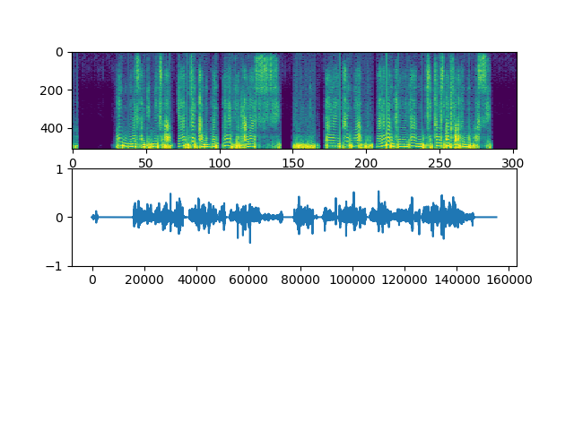
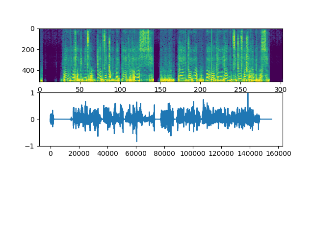

# 実験レポート
|index|value|
|:----|:----|
|No.|1|
|執筆|TODA|
|対応バージョン|19.1.15.1|

# Generatorの深さと結果の精度について

## 実験内容
Generatorにおけるレイヤーの深さの変更が与える生成精度の違いを測定する。
## 実施時間と構造
- 各100000イテレーション
- Dは変更なし
- 学習率 8e-7
 
| Index  |3Layers|4Layers|
|:------:|:-----:|:-----:|
|Training|None|1h29m35s|

##結果

- 3Layers

- 4Layers

#結果と考察
