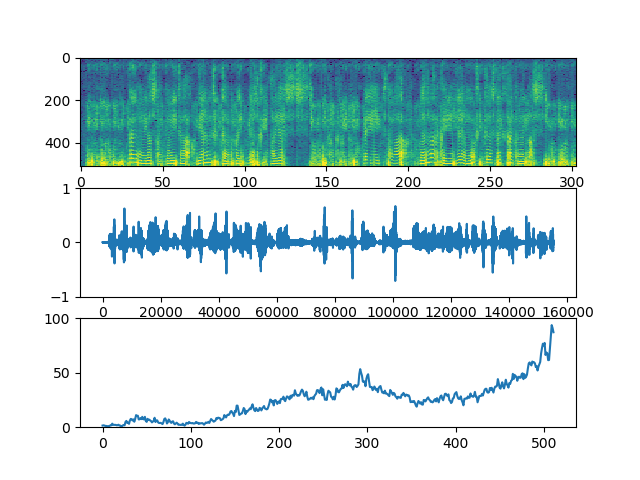
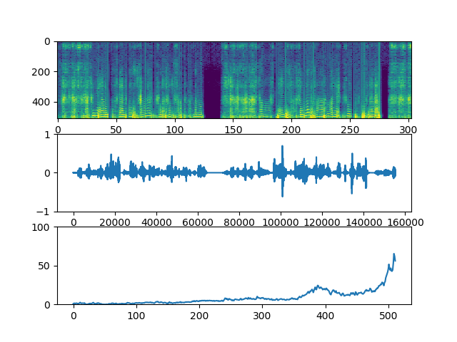
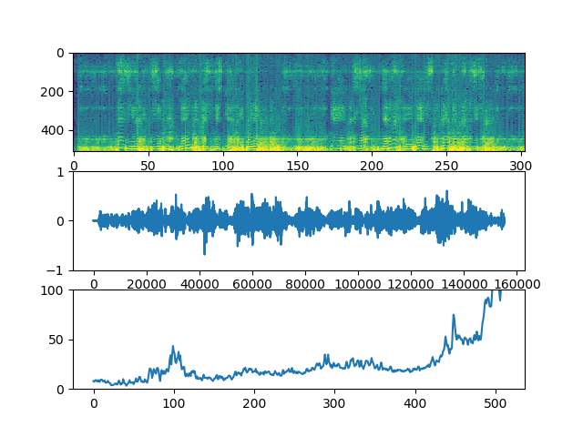

# 実験レポート
|index|value|
|:----|:----|
|No.|3|
|執筆|TODA|
|対応バージョン|19.1.22.4|

# Dにおける構造の重要性

## 問題提起
　CycleGANにおいてDは敵対するとともに教師の役割を担っている。Gへ適切な勾配を伝搬するにあたり、従来の手法では敵対する際の表現性能と伝搬の両立が容易ではなかったため、このモデルの限界とされる表現能力が存在していた。
 
　本研究はそれらを解決すべく、様々なアプローチでの解決を図る。

## 手法

### Dhortcut-Bonnection(SC)

- resnet
- SEnet(Attention Architecture)

### Normalization(NO)

- BatchNormalization
- InstanceNormalization

### Regulalization(DO)

- DropOut
- Shakedrop
- rectange-noise
- L2norm

## 手法背景と実験結果

### SC
#### ソリューション背景
SCにおける解決方法は、各モジュールを分離して残差的な学習を行うことにより、勾配の損失（爆発や消失）を防ぐことにある。ただし、Dの表現能力を下げるような構造を用いてはいけない。

#### 実験
本実験は以下の条件で行った。
- BNを用いない。
- 学習率は適宜変更している。
- バッチサイズ128,エポック140

##### resnet

##### SENet

#### 考察
SENetは表現能力を制限せずに勾配問題を解決しているような構造であるためResnetと比較してより目標のドメインを学習していると見られる。

### NO
#### ソリューション背景
NOでは、各畳み込み層の後に配置して正規化を行い勾配の消失を防ぐことにある。

#### 実験
本実験は以下の条件で行った。
- resnet
- 学習率は8e-6
- バッチサイズ128,エポック140

##### None

##### InstanceNorm

#### 考察
InstanceNormalizationは画像をぼかすような性質があることが判明した。おそらく、白色化の過程で画像のコントラストが消失してしまっていることがあげられる。

