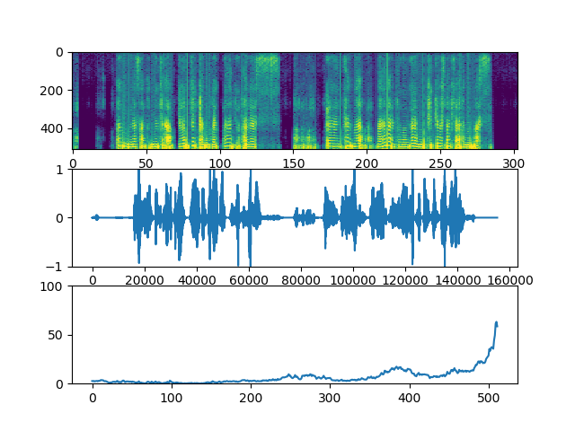
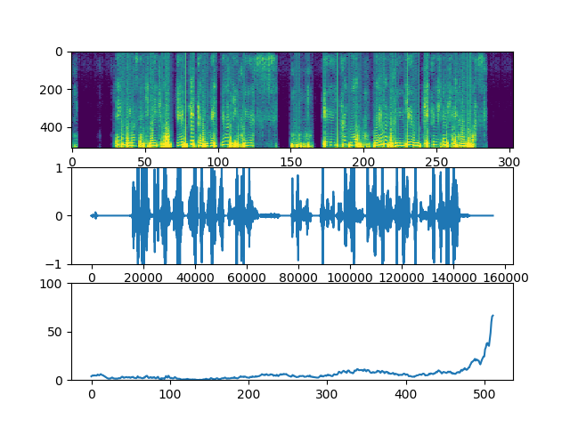

# 実験レポート
|index|value|
|:----|:----|
|No.|2|
|執筆|TODA|
|対応バージョン|19.1.16.1|

# GLUの役割について

## 実験内容
GeneratorにおけるGLUの必要性を検証する
## 実施時間と構造
- 各100000イテレーション
- Dは変更なし
- 学習率 4e-6
 
| Index  |GLUあり|GLUなし|
|:------:|:-----:|:-----:|
|Training|1h21m01s|1h29m35s|

## 結果

　
# 考察
GLU 構造が学習を阻害していることが分かった。今後のモデルでは使われることがないだろう。