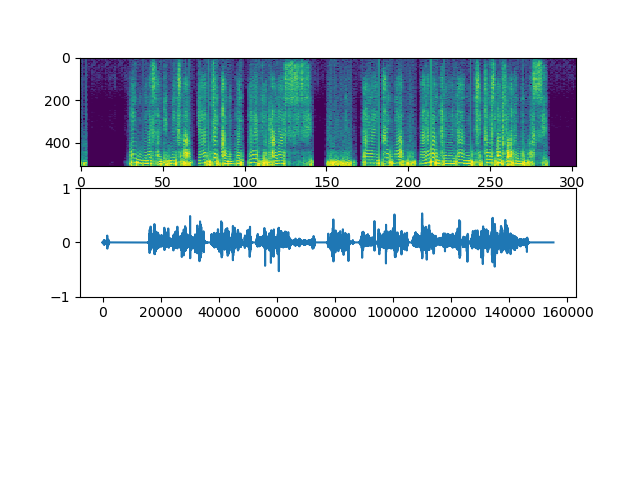
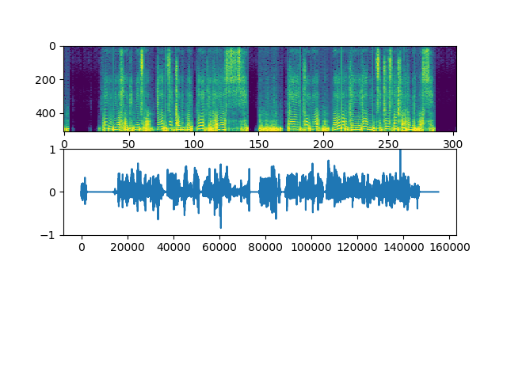

# 実験レポート
|index|value|
|:----|:----|
|No.|1|
|執筆|TODA|
|対応バージョン|19.1.15.1|

# Generatorの深さと結果の精度について

## 実験内容
Generatorにおけるレイヤーの深さの変更が与える生成精度の違いを測定する。
## 実施時間と構造
- 各100000イテレーション
- Dは変更なし
- 学習率 8e-7
 
| Index  |3Layers|4Layers|
|:------:|:-----:|:-----:|
|Training|1h21m01s|1h29m35s|

##結果

- 3Layers

- 4Layers

# 考察

　3層が適切な深度であることが判明した。単にGの構造を深くするだけでは精度が上がらないことが実験結果から得られた。

　今回は残差を用いなかったが、用いた場合ではより深くすることが可能になるのではないかという予測ができる。

　より一層の精度向上に向けて、Dの与える影響も詳しく調査するべき事項である。今回においては256の隠れ層のみであったが、よりディープにすることも検討できる。ただし、BNを入れずにそのまま増やすと、Gへの逆伝搬が悪くなってしまい精度が悪化する。よって、残差を用いるや、BNを用いるなどの対策が必要である。