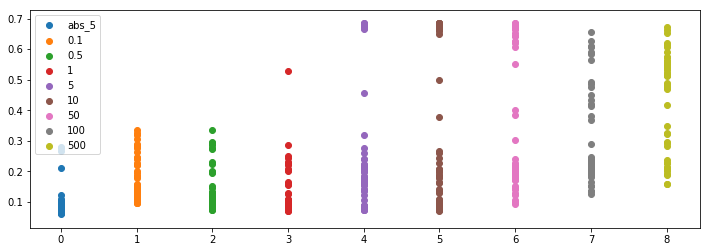
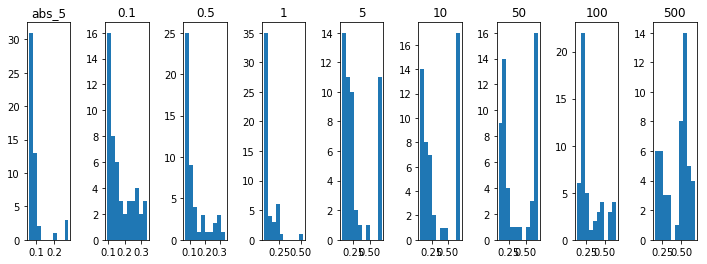
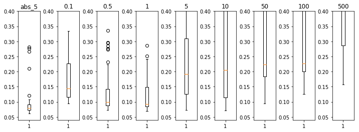

# 学習用パラメータ探索レポート
## 探索したパラメータについて

 変換した音声が不明瞭になることへの対策として、CycleLossをmaeからmseに変更し、パラメータ探索を行った。

## 実験

### 条件
 各学習について800itrを5回ずつテストを行った。

 扱ったのは以下モデル
 - resnet(conv(k11c256)-leakyrelu-add)9blocks
 
 様子を見るため以下のパラメータで実験を行った
 ```
 [0.1, 0.5, 1.0, 5.0, 10.0, 50.0, 100.0, 500.0]
 ```
 ## 結果
 <!-- TODO: ココから実験後記述 -->



 
詳しいデータは[log.csv参照](log.csv)

### 考察
 mseはmaeに比べ勾配に大きさが加わるが結果的に変換効率を下げてしまう傾向にある。
 cycleganの論文にもあるようにL1ノルムのような”曖昧な”損失であったほうがGANの性質上うまく変換できる

 このほかL2ノルム等も試験的に導入していて、結果が悪くないので今後は本格的に調査をしたい

  